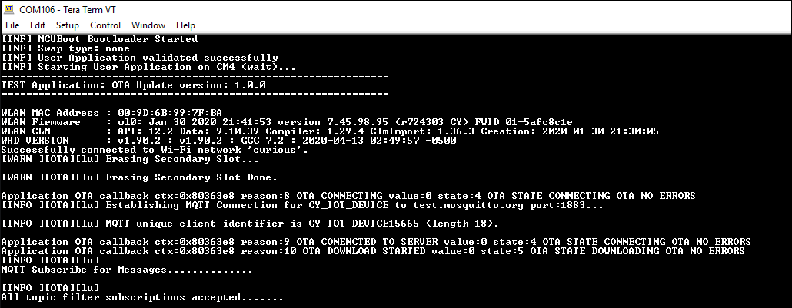
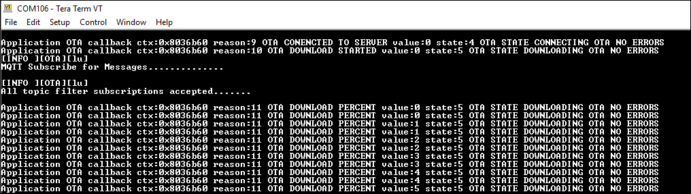
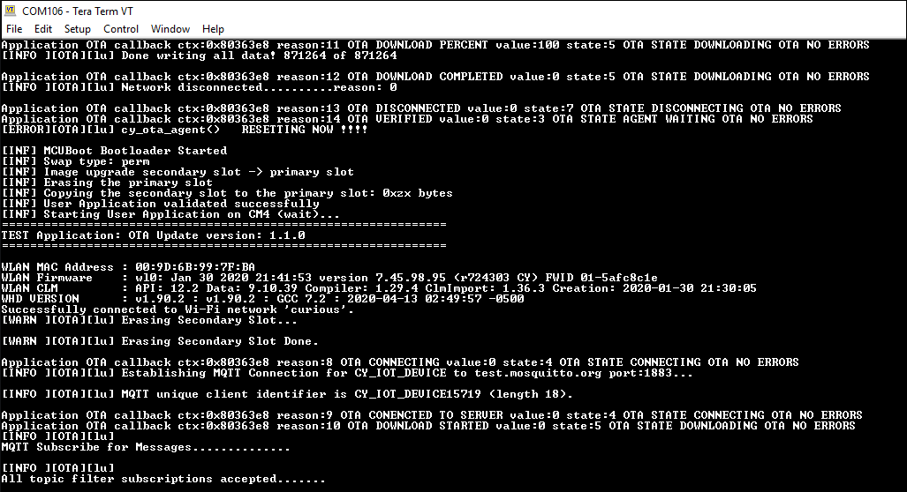
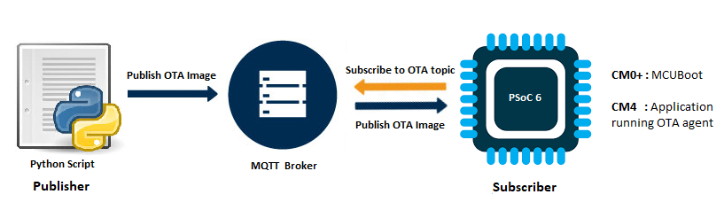

# AnyCloud Example: Over-the-Air Firmware Update Using MQTT

This code example demonstrates Over-the-Air (OTA) update with PSoC® 6 MCU and CYW43xxx connectivity devices. The device establishes a connection with the designated MQTT Broker (Mosquitto is used in this example) and subscribes to a topic. When an OTA image is published to that topic, the device automatically pulls the OTA image over MQTT, saves it to the flash memory, and issues a software reset. The device uses MCUBoot as a bootloader that boots the newly downloaded image after reset.

MCUboot is a secure bootloader for 32-bit MCUs. See the [MCUBoot](https://juullabs-oss.github.io/mcuboot/) website for more details.

The OTA feature is enabled by the *Over-the-Air update middleware library*. See the [anycloud-ota](https://github.com/cypresssemiconductorco/anycloud-ota) middleware repository on Github for more details.

## Requirements

- [ModusToolbox™ software](https://www.cypress.com/products/modustoolbox-software-environment) v2.1
- [Cypress Programmer](https://www.cypress.com/products/psoc-programming-solutions)
- Programming Language: C
- Associated Parts: All [PSoC 6 MCU](http://www.cypress.com/PSoC6) parts with SDIO interface

## Supported Kits

- [PSoC 6 Wi-Fi BT Prototyping Kit](https://www.cypress.com/CY8CPROTO-062-4343W) (CY8CPROTO-062-4343W) - Default target
- [PSoC 62S2 Wi-Fi BT Pioneer Kit](https://www.cypress.com/CY8CKIT-062S2-43012) (CY8CKIT-062S2-43012)

## Hardware Setup

This example uses the board's default configuration. See the kit user guide to ensure that the board is configured correctly.

**Note**: The PSoC 6 BLE Pioneer Kit (CY8CKIT-062-BLE) and the PSoC 6 WiFi-BT Pioneer Kit (CY8CKIT-062-WIFI-BT) ship with KitProg2 installed. ModusToolbox software requires KitProg3. Before using this code example, make sure that the board is upgraded to KitProg3. The tool and instructions are available in the [Firmware Loader](https://github.com/cypresssemiconductorco/Firmware-loader) GitHub repository. If you do not upgrade, you will see an error like "unable to find CMSIS-DAP device" or "KitProg firmware is out of date".

## Software Setup

- Install a terminal emulator if you don't have one. Instructions in this document use [Tera Term](https://ttssh2.osdn.jp/index.html.en).

- Install a Python Interpreter if you don't have one. This code example is tested using [Python 3.7.7](https://www.python.org/downloads/release/python-377/), but other versions may work.

## Code Example Structure and Overview

This code example is a dual-core project, where the MCUBoot runs on CM0+ core and OTA update app runs on CM4 core. Users have to first build and program the MCUBoot project into CM0+ core, this has to be done only once. The OTA update app can then be programmed into CM4 core, users need to only modify this app for all application purposes.

## Building and Programming MCUBoot

### Configuring MCUBoot

1. Clone MCUBoot recursively from [GitHub](https://github.com/JuulLabs-OSS/mcuboot). Make sure to clone it outside the code example directory.
   ```
   git clone https://github.com/JuulLabs-OSS/mcuboot.git --branch v1.5.0-cypress --recursive
   ```

2. Install the required python packages mentioned in *\<mcuboot>/scripts/requirements.txt*. Navigate to *\<mcuboot>/scripts* and run the following command:
   ```
   pip3 install -r requirements.txt
   ```
3. MCUBoot and the OTA application must have the same understanding of the memory layout. Override the default memory layout by adding the following defines in the file *\<mcuboot>/boot/cypress/MCUBootApp/MCUBootApp.mk*.

   ```
   DEFINES_APP +=-DMCUBOOT_MAX_IMG_SECTORS=2000
   DEFINES_APP +=-DCY_BOOT_BOOTLOADER_SIZE=0x12000
   DEFINES_APP +=-DCY_BOOT_SCRATCH_SIZE=0x10000
   DEFINES_APP +=-DCY_BOOT_PRIMARY_1_SIZE=0x0EE000
   DEFINES_APP +=-DCY_BOOT_SECONDARY_1_SIZE=0x0EE000
   ```
4. In file *\<mcuboot>/boot/cypress/MCUBootApp/toolchains.mk* update the TOOLCHAIN Path. 

   ```
   TOOLCHAIN_PATH ?= c:/Users/$(USERNAME)/ModusToolbox/tools_2.1/gcc-7.2.1
   ```
5. Open *\<mcuboot>/boot/cypress/MCUBootApp/config/mcuboot_config/mcuboot_config.h* and comment out the following defines to skip checking the image signature:

   ```
   #define MCUBOOT_SIGN_EC256
   #define NUM_ECC_BYTES (256 / 8)
   .
   .
   . 
   #define MCUBOOT_VALIDATE_PRIMARY_SLOT
   ```
   

**Note:** This example does not demonstrate securely upgrading the image and booting from it using the features such as image-signing, secure boot, and so on. See the [PSoC 64 Line of Secure MCUs](https://www.cypress.com/psoc64) that offer all those features built around MCUBoot.

### Building MCUBoot

1. Open a CLI terminal and navigate to *\<mcuboot>/boot/cypress/*. On Windows, you can use Cygwin to run the make command. To run Cygwin, navigate to the modus-shell directory (*{ModusToolbox install directory}/tools_\<version>/modus-shell*) and run *Cygwin.bat*.

2. Build the application using `make`:  
    ```
    make app APP_NAME=MCUBootApp PLATFORM=PSOC_062_2M IMG_TYPE=BOOT CURDIR=$(cygpath --mixed $(pwd))
    ```

### Programming MCUBoot

Use [Cypress Programmer](https://www.cypress.com/products/psoc-programming-solutions) to program the *MCUBootApp.elf* file generated under *\<mcuboot>/boot/cypress/MCUBootApp/out/PSOC_062_2M/Debug*.

## Programing and Running the OTA update example

### In Eclipse IDE for ModusToolbox:

1. Click the **New Application** link in the Quick Panel (or, use **File** > **New** > **ModusToolbox Application**).

2. Pick a kit supported by the code example from the list shown in the **Project Creator - Choose Board Support Package (BSP)** dialog.

   When you select a supported kit, the example is reconfigured automatically to work with the kit. To work with a different supported kit later, use the **Library Manager** to choose the BSP for the supported kit. You can use the Library Manager to select or update the BSP and firmware libraries used in this application. To access the Library Manager, right-click the application name from the Project Workspace window in the IDE, and select **ModusToolbox** > **Library Manager**. You can also access it from the **Quick Panel**.

   You can also just start the application creation process again and select a different kit.

   If you want to use the application for a kit not listed here, you may need to update source files. If the kit does not have the required resources, the application may not work.

3. In the **Project Creator - Select Application** dialog, choose the example.

4. Optionally, update the **Application Name:** and **Location** fields with the application name and local path where application is created.

5. Click **Create** to complete the application creation process.

For more details, see the Eclipse IDE for ModusToolbox User Guide: *{ModusToolbox install directory}/ide_{version}/docs/mt_ide_user_guide.pdf*.

### In Command-line Interface (CLI):

1. Download and unzip this repository onto your local machine, or clone the repository.

2. Open a CLI terminal and navigate to the application folder. On Linux and macOS, you can use any terminal application. On Windows, navigate to the modus-shell directory (*{ModusToolbox install directory}/tools_\<version>/modus-shell*) and run *Cygwin.bat*.

3. Import required libraries by executing the `make getlibs` command.

### In Third-party IDEs:

1. Follow instructions from the CLI section to download or clone the repository, and import libraries using `make getlibs` command.

2. Export the application to a supported IDE using the `make <ide>` command.

3. Follow instructions displayed in the terminal to create or import the application as an IDE project.

For more details, see the "Exporting to IDEs" section of the ModusToolbox User Guide: *{ModusToolbox install directory}/ide_{version}/docs/mtb_user_guide.pdf*.

## Operation

**Note:** This example uses the public MQTT broker [test.mosquitto.org](https://test.mosquitto.org/). This broker may not be available at all times. In that case, you can install and run the Mosquitto broker on your computer. The Mosquitto broker is available for download at [https://mosquitto.org/download/](https://mosquitto.org/download/) or you can use one of the other public MQTT brokers listed at [https://github.com/mqtt/mqtt.github.io/wiki/public_brokers](https://github.com/mqtt/mqtt.github.io/wiki/public_brokers).

The [test.mosquitto.org](https://test.mosquitto.org/) broker uses the SHA-1 hashing algorithm for certificate signing. This code example enables SHA-1 support in Mbed TLS and MQTT Client libraries by following the instructions in [Quick Start](https://github.com/cypresssemiconductorco/mqtt/blob/master/README.md#quick-start), to connect to the broker in TLS mode. As cautioned by Mbed TLS, SHA-1 is considered a weak message digest. The use of SHA-1 for certificate signing constitutes a security risk. It is recommended to avoid dependencies on it, and consider stronger message digests instead. **You should remove the configurations enabling SHA-1 if you are reusing this code example in your application**.

1. Connect the board to your PC using the provided USB cable through the KitProg3 USB connector.

2. Modify the connection configuration like `WIFI_SSID`, `WIFI_PASSWORD`, and `WIFI_SECURITY` macros to match the settings of your Wi-Fi network. These macros are defined in the *\<Application Name>/source/ota_app_config.h* file.   
   
   By default, this code example works in non-TLS mode. Follow the steps below to enable TLS mode.

   - **Using the Code Example in TLS Mode**:

      1. Modify the value of `ENABLE_TLS` to `(true)` in the *\<Application Name>/source/ota_app_config.h* file. 
   
      2. Modify the value of `MQTT_SERVER_PORT` to `(8884)` in the *\<Application Name>/source/ota_app_config.h* file.
   
      3. Generate the client certificate and the private key according to the instructions from [https://test.mosquitto.org/](https://test.mosquitto.org/). Root CA certificate is available at [https://test.mosquitto.org/ssl/mosquitto.org.crt](moshttps://test.mosquitto.org/ssl/mosquitto.org.crtquitto.org.crt).
   
4. Add the Root CA certificate, client certificate, and private key to the *\<Application Name>/source/ota_app_config.h* file as per the sample shown.
   
3. Open the python script *\<Application Name>/scripts/mqtt_ota_publisher.py* and change the value of `KIT` to the target board being used.

4. Open a terminal program and select the KitProg3 COM port. Set the serial port parameters to 8N1 and 115200 baud.

5. Program the board. 

   - **Using Eclipse IDE for ModusToolbox**:

      1. Select the application project in the Project Explorer.

      2. In the **Quick Panel**, scroll down, and click **\<Application Name> Program (KitProg3)**.

   - **Using CLI**:

      1. From the terminal, execute the `make program` command to build and program the application using the default toolchain to the default target. You can specify a target and toolchain manually:
         ```
         make program TARGET=<BSP> TOOLCHAIN=<toolchain>
         ```
         Example:

         ```
         make program TARGET=CY8CPROTO-062-4343W TOOLCHAIN=GCC_ARM
         ```
         **Note**:  Before building the application, ensure that the *deps* folder contains the BSP file (*TARGET_xxx.lib*) corresponding to the TARGET. Execute the `make getlibs` command to fetch the BSP contents before building the application.
   
   At this point, the primary slot is programmed and Arm® Cortex®-M4 starts running the image from the primary slot on reset. Observe the messages on the UART terminal, wait for the device to make the required connections as shown in the Figure 1. Also, the user LED will blink at 1 Hz.

   **Figure 1. Connection to MQTT Broker**

   

6. Modify the value of the `BLINKY_DELAY_MS` macro to `(100)` in the *\<Application Name>/source/led_task.c* and change the app version in the *\<Application Name>/Makefile* by setting `APP_VERSION_MINOR` to 1. Build the app, this new image will be published to the MQTT broker to demonstrate OTA update.

   - **Using Eclipse IDE for ModusToolbox**:

      1. Select the application project in the Project Explorer.

      2. In the **Quick Panel**, scroll down, and click **Build \<Application Name> Application**.

   - **Using CLI**:

      1. From the terminal, execute the `make build` command to build the application using the default toolchain to the default target. You can specify a target and toolchain manually:
         ```
         make build TARGET=<BSP> TOOLCHAIN=<toolchain>
         ```
         Example:

         ```
         make build TARGET=CY8CPROTO-062-4343W TOOLCHAIN=GCC_ARM
         ```

7. Run the python script *\<Application Name>/scripts/mqtt_ota_publisher.py*. This will publish the upgraded image. Install the *paho-mqtt* python package required for running the script:
   ```
   pip3 install paho-mqtt
   ```

   **Note:** By default, the script works in non-TLS mode.

   - **Using the Script in TLS Mode**:

      1. Modify the value of `TLS_ENABLED` to `True` and `BROKER_PORT` to `8884` in the *\<Application Name>/scripts/mqtt_ota_publisher.py* file. 

      2. Generate the client certificate and the private key according to the instruction from [https://test.mosquitto.org/](https://test.mosquitto.org/) or you can use the same client certificate and key used with the OTA firmware application.

      3. Add the Root CA certificate, client certificate, and private key to the *\<Application Name>/scripts* folder and run the script. Name the files as listed below or you will modify the filenames in the script:
         - Root CA certificate: mosquitto.org.crt
         - Client certfile: client.crt
         - Private key: client.key

8. Observe the UART terminal to see the OTA image being received in chunks.

   **Figure 2. Receiving New Image**

   

9. Once all chunks are received and are written to the secondary slot in the flash, the device will reboot. MCUBoot will verify the new image, copy it to the primary, and boot the new application.

   **Figure 3. Booting New Image**

   

10. Observe that the user LED now blinking a 10 Hz.

## Debugging

You can debug the example to step through the code. In the IDE, use the **\<Application Name> Debug (KitProg3)** configuration in the **Quick Panel**. For more details, see "Program and Debug" section in the Eclipse IDE for ModusToolbox User Guide: *{ModusToolbox install directory}/ide_{version}/docs/mt_ide_user_guide.pdf*.

## Design and Implementation

The flow of the OTA update feature can be represented as shown in Figure 4. The flow consists of three parts: publisher script, MQTT broker, and subscriber device. The subscriber device that requires the OTA update runs the OTA agent and subscribes to an MQTT topic with the broker. The device will later receive the new image from the broker on this topic. The publisher implemented through a python script publishes an upgrade image to the MQTT broker on the same topic.

**Figure 4. Code Example Overview**


On the device side, the flow involves building of two applications - MCUBoot-based bootloader and the application that performs OTA.

MCUboot is a secure bootloader for 32-bit MCUs. The goal of MCUboot is to define a common infrastructure for the bootloader, system flash layout on microcontroller systems, and to provide a secure bootloader that enables simple software upgrades. In this example, the MCUBootApp runs on Cortex-M0+ core to verify, copy, and run the application on CM4 core.

The application which needs the OTA updates should run the OTA agent. The OTA agent spawns threads to receive OTA updates when available, without intervening with the application's core functionality. The initial application resides in the primary slot of the flash memory. When the OTA agent receives an update, the new image is placed in the secondary slot of the flash memory. On the next reboot, the MCUBoot will copy the image from the secondary slot into the primary slot and then CM4 will boot the upgraded image from the primary slot.

### Memory Layout in PSoC 6 with 2 MB Flash

The device has an internal flash of size 2 MB. The memory is partitioned into four regions.

**Figure 5. Flash Memory Layout**


1. Bootloader region of size 72 KB.

2. Primary memory slot of size 952 KB. This region holds the factory image, which is currently being executed.

3. Secondary memory slot of size 952 KB. The OTA agent downloads the update image and stores it in this region.

4. Scratch memory of size 64 KB. MCUBoot supports images that are built to run from flash from a fixed location. If the updated image downloaded to the secondary slot is to be executed, then either the primary slot is overwritten by the secondary slot or the contents of two slots are swapped. This region is used for swapping between the primary and secondary slots. 

The Cypress port for MCUBoot currently doesn't support swapping. Everytime the device reboots, the secondary slot is erased to prepare for receving the update. The image downloaded onto the secondary slot by the OTA agent is stored temporarily. Upon reboot, MCUBoot validates and copies the secondary slot to the primary slot. This process repeats itself whenever a new update is received.

It is important for both MCUBoot and the application to have the exact same understanding of the memory layout. Otherwise, the bootloader may consider an authentic image as invalid. To learn more about the bootloader refer to the [MCUBoot](https://github.com/JuulLabs-OSS/mcuboot/blob/cypress/docs/design.md) documentation.

### Resources and Settings

**Table 1. Application Resources**

| Resource  |  Alias/Object     |    Purpose     |
| :-------  | :------------     | :------------  |
| GPIO (HAL)| CYBSP_USER_LED    | User LED       |

## Related Resources

| Application Notes                                            |                                                              |
| :----------------------------------------------------------- | :----------------------------------------------------------- |
| [AN228571](https://www.cypress.com/AN228571) – Getting Started with PSoC 6 MCU on ModusToolbox | Describes PSoC 6 MCU devices and how to build your first application with ModusToolbox |
| [AN221774](https://www.cypress.com/AN221774) – Getting Started with PSoC 6 MCU on PSoC Creator | Describes PSoC 6 MCU devices and how to build your first application with PSoC Creator |
| [AN210781](https://www.cypress.com/AN210781) – Getting Started with PSoC 6 MCU with Bluetooth Low Energy (BLE) Connectivity on PSoC Creator | Describes PSoC 6 MCU with BLE Connectivity devices and how to build your first application with PSoC Creator |
| [AN215656](https://www.cypress.com/AN215656) – PSoC 6 MCU: Dual-CPU System Design | Describes the dual-CPU architecture in PSoC 6 MCU, and shows how to build a simple dual-CPU design |
| **Code Examples**                                            |                                                              |
| [Using ModusToolbox](https://github.com/cypresssemiconductorco/Code-Examples-for-ModusToolbox-Software) | [Using PSoC Creator](https://www.cypress.com/documentation/code-examples/psoc-6-mcu-code-examples) |
| **Device Documentation**                                     |                                                              |
| [PSoC 6 MCU Datasheets](https://www.cypress.com/search/all?f[0]=meta_type%3Atechnical_documents&f[1]=resource_meta_type%3A575&f[2]=field_related_products%3A114026) | [PSoC 6 Technical Reference Manuals](https://www.cypress.com/search/all/PSoC%206%20Technical%20Reference%20Manual?f[0]=meta_type%3Atechnical_documents&f[1]=resource_meta_type%3A583) |
| **Development Kits**                                         | Buy at www.cypress.com                                       |
| [CY8CKIT-062-BLE](https://www.cypress.com/CY8CKIT-062-BLE) PSoC 6 BLE Pioneer Kit | [CY8CKIT-062-WiFi-BT](https://www.cypress.com/CY8CKIT-062-WiFi-BT) PSoC 6 WiFi-BT Pioneer Kit |
| [CY8CPROTO-063-BLE](https://www.cypress.com/CY8CPROTO-063-BLE) PSoC 6 BLE Prototyping Kit | [CY8CPROTO-062-4343W](https://www.cypress.com/CY8CPROTO-062-4343W) PSoC 6 Wi-Fi BT Prototyping Kit |
| [CY8CKIT-062S2-43012](https://www.cypress.com/CY8CKIT-062S2-43012) PSoC 62S2 Wi-Fi BT Pioneer Kit | [CY8CPROTO-062S3-4343W](https://www.cypress.com/CY8CPROTO-062S3-4343W) PSoC 62S3 Wi-Fi BT Prototyping Kit |
| [CYW9P62S1-43438EVB-01](https://www.cypress.com/CYW9P62S1-43438EVB-01) PSoC 62S1 Wi-Fi BT Pioneer Kit | [CYW9P62S1-43012EVB-01](https://www.cypress.com/CYW9P62S1-43012EVB-01) PSoC 62S1 Wi-Fi BT Pioneer Kit |                                                              |
| **Libraries**                                                |                                                              |
| PSoC 6 Peripheral Driver Library (PDL) and docs                    | [psoc6pdl](https://github.com/cypresssemiconductorco/psoc6pdl) on GitHub |
| Cypress Hardware Abstraction Layer (HAL) Library and docs          | [psoc6hal](https://github.com/cypresssemiconductorco/psoc6hal) on GitHub |
| RetargetIO - A utility library to retarget the standard input/output (STDIO) messages to a UART port | [retarget-io](https://github.com/cypresssemiconductorco/retarget-io) on GitHub |
| **Middleware**                                               |                                                              |
| AnyCloud OTA library and docs                                | [anycloud-ota](https://github.com/cypresssemiconductorco/anycloud-ota) on GitHub |
| Wi-Fi Middleware Core library and docs                       | [wifi-mw-core](https://github.com/cypresssemiconductorco/wifi-mw-core) on GitHub |
| CapSense library and docs                                    | [capsense](https://github.com/cypresssemiconductorco/capsense) on GitHub |
| Links to all PSoC 6 MCU Middleware                           | [psoc6-middleware](https://github.com/cypresssemiconductorco/psoc6-middleware) on GitHub |
| **Tools**                                                    |                                                              |
| [Eclipse IDE for ModusToolbox](https://www.cypress.com/modustoolbox)     | The multi-platform, Eclipse-based Integrated Development Environment (IDE) that supports application configuration and development for PSoC 6 MCU and IoT designers.             |
| [PSoC Creator](https://www.cypress.com/products/psoc-creator-integrated-design-environment-ide) | The Cypress IDE for PSoC and FM0+ MCU development.            |

## Other Resources

Cypress provides a wealth of data at www.cypress.com to help you select the right device, and quickly and effectively integrate it into your design.

For PSoC 6 MCU devices, see [How to Design with PSoC 6 MCU - KBA223067](https://community.cypress.com/docs/DOC-14644) in the Cypress community.

## Document History

Document Title: CE230031 - AnyCloud Example: Over-the-Air Firmware Update Using MQTT

| Version | Description of Change |
| ------- | --------------------- |
| 1.0.0   | New code example      |

------

All other trademarks or registered trademarks referenced herein are the property of their respective owners.


-------------------------------------------------------------------------------

© Cypress Semiconductor Corporation, 2020. This document is the property of Cypress Semiconductor Corporation and its subsidiaries ("Cypress"). This document, including any software or firmware included or referenced in this document ("Software"), is owned by Cypress under the intellectual property laws and treaties of the United States and other countries worldwide. Cypress reserves all rights under such laws and treaties and does not, except as specifically stated in this paragraph, grant any license under its patents, copyrights, trademarks, or other intellectual property rights. If the Software is not accompanied by a license agreement and you do not otherwise have a written agreement with Cypress governing the use of the Software, then Cypress hereby grants you a personal, non-exclusive, nontransferable license (without the right to sublicense) (1) under its copyright rights in the Software (a) for Software provided in source code form, to modify and reproduce the Software solely for use with Cypress hardware products, only internally within your organization, and (b) to distribute the Software in binary code form externally to end users (either directly or indirectly through resellers and distributors), solely for use on Cypress hardware product units, and (2) under those claims of Cypress's patents that are infringed by the Software (as provided by Cypress, unmodified) to make, use, distribute, and import the Software solely for use with Cypress hardware products. Any other use, reproduction, modification, translation, or compilation of the Software is prohibited.  
TO THE EXTENT PERMITTED BY APPLICABLE LAW, CYPRESS MAKES NO WARRANTY OF ANY KIND, EXPRESS OR IMPLIED, WITH REGARD TO THIS DOCUMENT OR ANY SOFTWARE OR ACCOMPANYING HARDWARE, INCLUDING, BUT NOT LIMITED TO, THE IMPLIED WARRANTIES OF MERCHANTABILITY AND FITNESS FOR A PARTICULAR PURPOSE. No computing device can be absolutely secure. Therefore, despite security measures implemented in Cypress hardware or software products, Cypress shall have no liability arising out of any security breach, such as unauthorized access to or use of a Cypress product. CYPRESS DOES NOT REPRESENT, WARRANT, OR GUARANTEE THAT CYPRESS PRODUCTS, OR SYSTEMS CREATED USING CYPRESS PRODUCTS, WILL BE FREE FROM CORRUPTION, ATTACK, VIRUSES, INTERFERENCE, HACKING, DATA LOSS OR THEFT, OR OTHER SECURITY INTRUSION (collectively, "Security Breach"). Cypress disclaims any liability relating to any Security Breach, and you shall and hereby do release Cypress from any claim, damage, or other liability arising from any Security Breach. In addition, the products described in these materials may contain design defects or errors known as errata which may cause the product to deviate from published specifications. To the extent permitted by applicable law, Cypress reserves the right to make changes to this document without further notice. Cypress does not assume any liability arising out of the application or use of any product or circuit described in this document. Any information provided in this document, including any sample design information or programming code, is provided only for reference purposes. It is the responsibility of the user of this document to properly design, program, and test the functionality and safety of any application made of this information and any resulting product. "High-Risk Device" means any device or system whose failure could cause personal injury, death, or property damage. Examples of High-Risk Devices are weapons, nuclear installations, surgical implants, and other medical devices. "Critical Component" means any component of a High-Risk Device whose failure to perform can be reasonably expected to cause, directly or indirectly, the failure of the High-Risk Device, or to affect its safety or effectiveness. Cypress is not liable, in whole or in part, and you shall and hereby do release Cypress from any claim, damage, or other liability arising from any use of a Cypress product as a Critical Component in a High-Risk Device. You shall indemnify and hold Cypress, its directors, officers, employees, agents, affiliates, distributors, and assigns harmless from and against all claims, costs, damages, and expenses, arising out of any claim, including claims for product liability, personal injury or death, or property damage arising from any use of a Cypress product as a Critical Component in a High-Risk Device. Cypress products are not intended or authorized for use as a Critical Component in any High-Risk Device except to the limited extent that (i) Cypress's published data sheet for the product explicitly states Cypress has qualified the product for use in a specific High-Risk Device, or (ii) Cypress has given you advance written authorization to use the product as a Critical Component in the specific High-Risk Device and you have signed a separate indemnification agreement.  
Cypress, the Cypress logo, Spansion, the Spansion logo, and combinations thereof, WICED, PSoC, CapSense, EZ-USB, F-RAM, and Traveo are trademarks or registered trademarks of Cypress in the United States and other countries. For a more complete list of Cypress trademarks, visit cypress.com. Other names and brands may be claimed as property of their respective owners.
